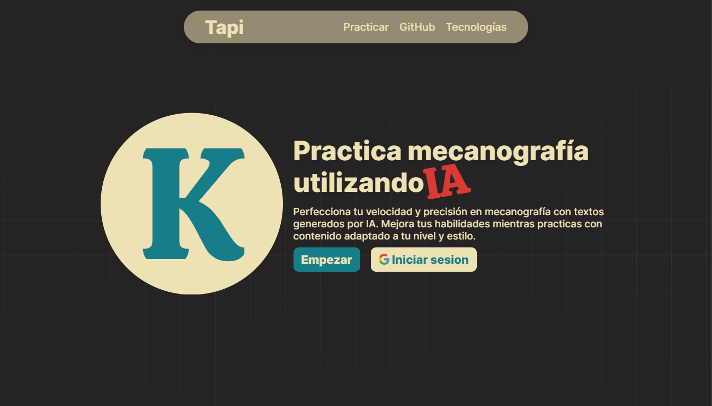

# Tapi

Tapi es una aplicación web que te permite practicar mecanografía utilizando textos y código generados por IA. Los textos se generan a partir de un prompt que el usuario ingresa y se requiere una API key de Gemini Flash 1.5 para la generación del contenido.

## Funcionalidades

- **Generación de Texto con IA:** Genera textos o fragmentos de código basados en un prompt proporcionado por el usuario.
- **Práctica de Mecanografía:** Ofrece una interfaz para practicar mecanografía con los textos generados.
- **Configuración de API Key:** La API key de Gemini Flash 1.5 se ingresa directamente en la interfaz de la web.

## Cómo Usar

1. Visita la aplicación en [tapi-xi.vercel.app](https://tapi-xi.vercel.app).
2. Ingresa tu API key de Gemini Flash 1.5 en el campo correspondiente en la web.
3. Introduce un prompt para generar el texto o código que deseas practicar.
4. Utiliza la interfaz para practicar mecanografía con el contenido generado.

## Tecnologías Utilizadas

- **React:** Para la interfaz de usuario.
- **Vercel AI SDK:** Para la generación de texto por IA.
- **Tailwind CSS:** Para el diseño y estilo de la página.

## Contribuciones

Las contribuciones son bienvenidas. Si tienes ideas para mejorar la aplicación, por favor abre un issue o envía un pull request.

## Contacto

Para cualquier pregunta o sugerencia, puedes abrir un issue en el repositorio o contactarme a través de dev.cristianb@gmail.com.

